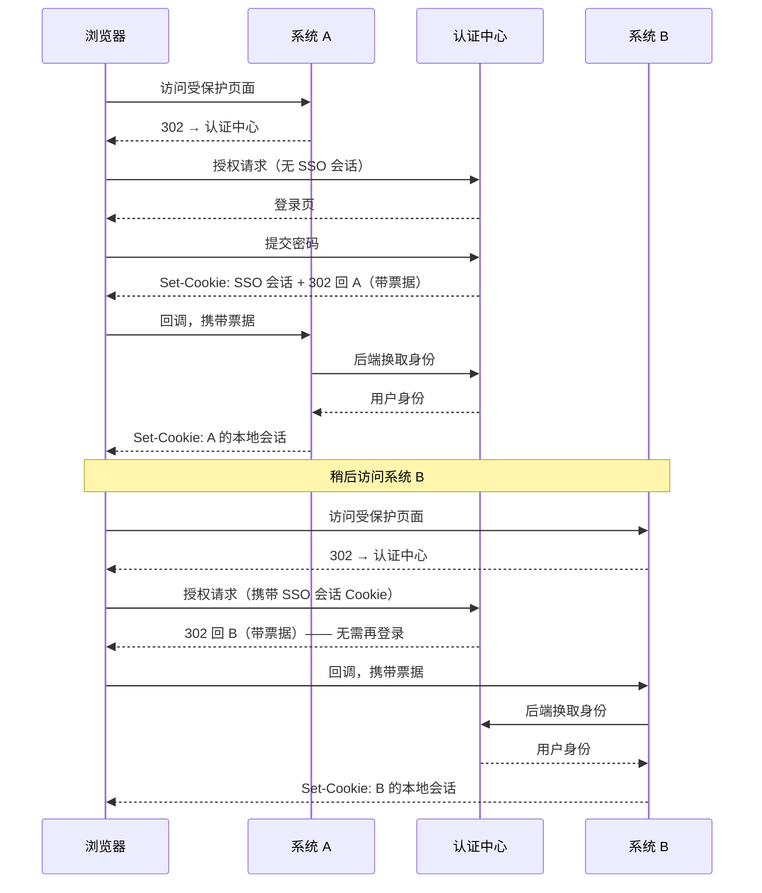
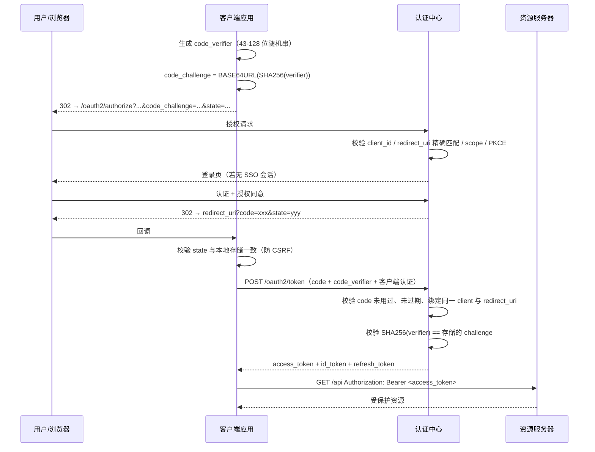
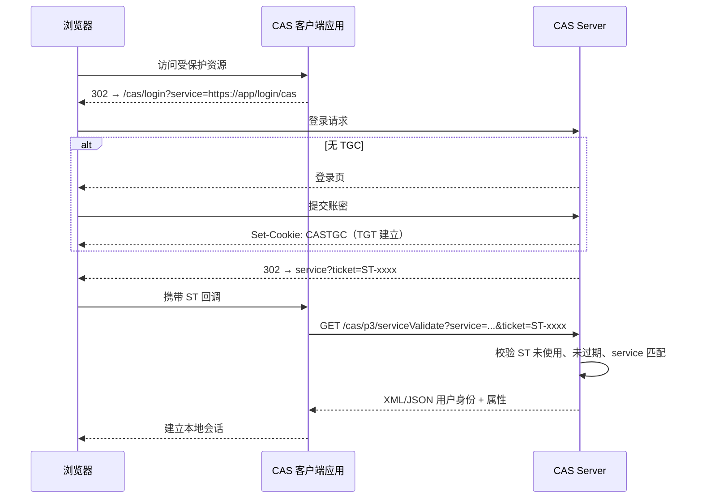

# Certus 统一认证中心：适用场景与协议说明

本文分两部分：

1. **适用场景** —— 统一认证中心解决什么问题、什么时候该上、什么时候不该上。
2. **协议详解** —— SSO、OAuth 2.0、OAuth 2.1、CAS 的原理、流程、参数、差异与选型。

文中凡涉及 Certus 当前代码的部分，都标注了实现状态：✅ 已实现、🚧 规划中。协议本身的说明与实现状态无关，可作为通用参考。

---

## 目录

- [第一部分：统一认证中心的适用场景](#第一部分统一认证中心的适用场景)
  - [1. 它是什么，不是什么](#1-它是什么不是什么)
  - [2. 核心价值](#2-核心价值)
  - [3. 典型适用场景](#3-典型适用场景)
  - [4. 不适用或过度设计的场景](#4-不适用或过度设计的场景)
  - [5. 引入前的前置条件](#5-引入前的前置条件)
- [第二部分：协议详解](#第二部分协议详解)
  - [6. 基础概念与角色](#6-基础概念与角色)
  - [7. SSO 单点登录](#7-sso-单点登录)
  - [8. OAuth 2.0](#8-oauth-20)
  - [9. OpenID Connect](#9-openid-connect)
  - [10. OAuth 2.1](#10-oauth-21)
  - [11. CAS](#11-cas)
  - [12. 协议选型矩阵](#12-协议选型矩阵)
- [第三部分：Certus 的落地形态](#第三部分certus-的落地形态)
  - [13. 实现状态一览](#13-实现状态一览)
  - [14. 接入系统注册模型](#14-接入系统注册模型)
  - [15. 四种典型接入方式](#15-四种典型接入方式)
  - [16. 安全基线](#16-安全基线)
- [参考规范](#参考规范)

---

# 第一部分：统一认证中心的适用场景

## 1. 它是什么，不是什么

统一认证中心（Identity Provider，IdP / Authentication Center）是组织内**唯一持有用户凭据并签发身份凭证**的服务。所有业务系统不再自己存密码、自己做登录页，而是把用户跳转到认证中心，凭认证中心签发的票据（Ticket / Code / Token）换取用户身份。

**它负责：**

| 职责 | 说明 |
| --- | --- |
| 身份存储 | 用户主档、用户名/邮箱唯一性、账号生命周期（active / locked / disabled） |
| 凭据校验 | 密码、LDAP、外部 IdP、后续的 MFA |
| 会话管理 | 一次登录、多系统复用；会话超时与强制下线 |
| 票据签发 | 授权码、访问令牌、ID Token、CAS Service Ticket |
| 协议适配 | 同一份身份，用 OAuth 2.0 / 2.1 / OIDC / CAS 多种协议对外暴露 |
| 审计 | 谁在什么时间从哪里登录了哪个系统 |

**它不负责（常见误区）：**

- **业务授权决策**。认证中心告诉你"这是谁"，"这个人能不能删除这张订单"应由业务系统或独立的授权服务判断。认证中心最多下发粗粒度的角色/scope。
- **业务用户资料**。手机号归属、部门层级、岗位这类业务属性放业务库或 HR 系统，认证中心只保留身份标识与最小画像（sub、username、email、display_name）。
- **API 网关**。令牌校验可以在网关做，但网关不是认证中心。
- **权限管理界面**。RBAC 的配置界面通常属于各业务系统或统一权限平台。

> 一句话边界：**认证中心回答 "who"，不回答 "what can"。**

## 2. 核心价值

按收益从高到低排序，用来判断是否值得投入：

1. **凭据面收敛。** 密码只存在一处。10 个系统各存一份密码哈希 = 10 个泄漏点、10 套加密策略、10 个撞库入口。收敛后，MFA、密码策略、暴力破解防护、泄漏密码检测只需实现一次。
2. **离职/入职一键生效。** 员工离职时禁用一个账号，全部系统立即失效。分散账号体系下，这件事永远做不干净——遗留的僵尸账号是真实的安全事故来源。
3. **用户体验。** 一次登录访问所有系统，不用记 10 套密码（否则用户必然复用同一个弱密码）。
4. **合规与审计。** 等保、ISO 27001、SOC 2 都要求可追溯的认证审计与统一的账号生命周期管理。分散体系下出审计报告是灾难。
5. **新系统接入成本。** 新系统不用再写注册/登录/找回密码/改密码/会话管理，接一个标准协议即可，通常 1 天内完成。
6. **外部身份联邦。** 接入企业微信、钉钉、飞书、Azure AD、Google Workspace 时只需改造认证中心一处。

## 3. 典型适用场景

### 3.1 企业内部多系统（最主流场景）

OA、CRM、财务、工单、BI、内部管理后台等 3 个以上系统共享同一批员工。

- **推荐协议**：OAuth 2.1 + OIDC（新系统）；CAS（Java 老系统，Spring Security CAS / Apereo 客户端库现成）。
- **收益点**：离职一键失效、统一 MFA、审计。

### 3.2 SaaS 多租户产品

产品有多个租户，部分企业客户要求用自己的 IdP 登录（SAML/OIDC 联邦）。

- **推荐协议**：OIDC 对内，联邦到租户 IdP 对外。
- **注意**：租户隔离必须体现在用户主档与客户端注册上，别让 A 租户的用户能在 B 租户的应用登录。

### 3.3 前后端分离的 Web 应用 / SPA

浏览器里跑的 React / Vue 应用，没有安全存储密钥的能力。

- **推荐协议**：OAuth 2.1 授权码 + PKCE，`public` 客户端，不发 client_secret。
- **强制要求**：PKCE S256、精确回调地址、刷新令牌轮换。Certus 直接拒绝 implicit 流程。

### 3.4 移动 App / 桌面客户端

同为公开客户端，且回调地址是自定义 scheme 或本地回环端口。

- **推荐协议**：OAuth 2.1 授权码 + PKCE，系统浏览器（非内嵌 WebView）承载登录页。
- **注意**：内嵌 WebView 让 App 能截获用户密码，破坏了 OAuth 的根本前提，OAuth Native Apps BCP（RFC 8252）明确反对。

### 3.5 服务间调用 / 定时任务

没有真人参与的机器身份。

- **推荐协议**：`client_credentials` 授权类型，`confidential` 客户端。
- **注意**：这类令牌代表的是**应用自己**，不是某个用户，不应包含 `sub` 为真人用户的语义。Certus 校验 `client_credentials` 必须搭配 `confidential` 客户端。

### 3.6 电视、机顶盒、CLI 工具、IoT 设备

输入手段受限，无法在设备上输密码。

- **推荐协议**：设备授权码（Device Authorization Grant，RFC 8628）。设备显示一个短码，用户在手机上输入完成授权。

### 3.7 遗留 Java 系统

已经在用 Apereo CAS 客户端、Spring Security CAS，或者需要代理认证（一个应用代表用户去调另一个应用）。

- **推荐协议**：CAS 2.0 / 3.0。改造成本最低，且 CAS 的代理票据（PGT/PT）在 OAuth 里没有直接等价物。

### 3.8 门户 + 子系统跳转

用户从统一门户点进各个子系统，期望无感切换。

- **推荐协议**：CAS 的 `gateway` 参数（已登录就静默通过，未登录也不强制拦截）或 OIDC 的 `prompt=none`。

## 4. 不适用或过度设计的场景

诚实地说，以下情况引入认证中心是负收益：

| 场景 | 原因 | 建议 |
| --- | --- | --- |
| 只有 1-2 个系统，且短期不会增加 | 运维一个高可用认证中心的成本 > 收益。认证中心宕机 = 全公司登录不了 | 系统内建登录，预留未来迁移的抽象层 |
| 纯内部脚本、无用户概念 | 没有身份可管 | mTLS 或 API Key |
| 用户完全隔离、无交叉访问的独立产品线 | SSO 无用武之地 | 各自独立，仅在需要时联邦 |
| 团队没有能力承担 7×24 可用性 | 认证中心是**单点故障放大器** | 用托管 IdP（Auth0 / Keycloak 托管 / 云厂商 IAM） |
| 需要极低延迟的高频内部调用 | 每次调用都验令牌会引入额外跳数 | 用 JWT 本地校验 + JWKS 缓存，避免 introspection |

**必须正视的风险：**

- 认证中心是全局单点。必须多实例部署、数据库高可用、有降级预案（例如令牌有效期内业务可用）。
- 一次协议实现错误会同时影响所有系统。这也是为什么应该严格遵循规范而不是自创流程。
- 迁移期成本高：老系统密码迁移、双跑期、用户教育。

## 5. 引入前的前置条件

- [ ] 确定权威身份源（HR 系统？AD？还是认证中心本身？）以及同步方向
- [ ] 定下用户唯一标识（`sub`）的语义：一旦下发，永不复用、永不变更
- [ ] 明确会话时长、令牌有效期、刷新窗口
- [ ] 规划单点登出的范围（是否需要真正的全局登出，还是各系统会话自然过期即可）
- [ ] 高可用与灾备方案
- [ ] 老系统的迁移路径与双跑期

---

# 第二部分：协议详解

## 6. 基础概念与角色

### 6.1 认证 vs 授权

| | 认证 Authentication | 授权 Authorization |
| --- | --- | --- |
| 回答 | 你是谁 | 你能做什么 |
| 产物 | 身份断言（ID Token、CAS 校验响应） | 访问凭证（Access Token、权限决策） |
| 协议 | OIDC、CAS、SAML | OAuth 2.0/2.1、XACML |

**关键认知：OAuth 2.0 本身是授权协议，不是认证协议。** 直接用 OAuth 的 Access Token 判断"用户是谁"是经典误用——Access Token 是给资源服务器用的，对客户端而言是不透明字符串，且不保证受众是你。做认证要用 OIDC 的 ID Token，或 CAS 的校验响应。

### 6.2 角色对照表

不同协议对同一角色的叫法不同，这是阅读规范时最容易混淆的地方：

| 通用角色 | OAuth 2.x | OIDC | CAS | SAML |
| --- | --- | --- | --- | --- |
| 认证中心 | Authorization Server (AS) | OpenID Provider (OP) | CAS Server | Identity Provider (IdP) |
| 接入系统 | Client | Relying Party (RP) | CAS Client / Service | Service Provider (SP) |
| 用户 | Resource Owner | End-User | Principal | Subject |
| 被保护的 API | Resource Server (RS) | — | — | — |

Certus 在代码里统一称接入系统为 `client`（见 [internal/client/client.go](../internal/client/client.go)）。

### 6.3 令牌类型辨析

| 令牌 | 发给谁用 | 受众 (aud) | 内容 | 典型有效期 |
| --- | --- | --- | --- | --- |
| **Authorization Code** | 客户端后端 | 认证中心 | 一次性随机串 | 30–60 秒 |
| **Access Token** | 资源服务器 | API | 权限范围 scope | 5–60 分钟 |
| **ID Token** | 客户端自己 | client_id | 用户身份声明 | 与登录会话相关 |
| **Refresh Token** | 认证中心 | 认证中心 | 换新令牌的凭据 | 数小时–数十天 |
| **CAS Service Ticket** | CAS Server | 单个 service | 一次性随机串 | 数秒–数十秒 |

**最常见的三个错误：**

1. 把 Access Token 当身份凭证解析 → 用 ID Token。
2. 把 ID Token 发给 API 当访问凭证 → 用 Access Token。
3. Refresh Token 存在浏览器 localStorage → 存 HttpOnly Cookie 或走 BFF 模式。

## 7. SSO 单点登录

### 7.1 SSO 不是一个协议

SSO 是**一种效果**：用户认证一次，就能访问多个相互信任的系统。实现它需要具体协议——CAS、OIDC、SAML 都能实现 SSO。所以"我们要上 SSO"这句话必须追问"用什么协议"。

### 7.2 SSO 的实现原理

无论哪个协议，机制都是同一个：

```
1. 认证中心在自己的域名下持有一个会话 Cookie（如 CASTGC、certus_session）
2. 用户访问系统 A → 无本地会话 → 跳转认证中心
3. 认证中心无 SSO 会话 → 展示登录页 → 用户输密码 → 建立 SSO 会话 Cookie
4. 认证中心签发只对系统 A 有效的一次性票据 → 跳回系统 A
5. 系统 A 后端用票据换取用户身份 → 建立系统 A 自己的本地会话
6. 用户访问系统 B → 无本地会话 → 跳转认证中心
7. 认证中心读到 SSO 会话 Cookie → 不展示登录页 → 直接签发系统 B 的票据 → 跳回
8. 用户视角：访问 B 时页面一闪，已登录
```

关键点在于**第 7 步的浏览器重定向携带了认证中心域名下的 Cookie**。这也解释了 SSO 的天然约束：**必须经过浏览器跳转**，纯 API 之间无法"顺带"实现 SSO。



### 7.3 三层会话模型

这是 SSO 设计中最容易被忽视、也最容易出问题的部分。**系统里同时存在三个独立的生命周期**：

| 层 | 存放位置 | 控制者 | 典型时长 |
| --- | --- | --- | --- |
| SSO 会话 | 认证中心域名下的 Cookie | 认证中心 | 8 小时（一个工作日） |
| 应用本地会话 | 各业务系统的 Cookie/Session | 各业务系统 | 30 分钟–2 小时 |
| 令牌 | 客户端持有 | 认证中心签发的有效期 | Access 15 分钟 / Refresh 数天 |

**必须提前想清楚的问题：**

- SSO 会话过期了，但应用本地会话还在 → 用户仍然能用业务系统。这通常是可接受的，但要写进设计文档，别让人误以为"登出了就全断了"。
- 用户在认证中心登出，业务系统的本地会话怎么办？→ 这就是单点登出问题。
- 管理员禁用了账号，已签发的 Access Token 还在有效期内 → 需要令牌吊销或缩短有效期。**这是"离职一键失效"承诺的真实边界，必须明确告知业务方。**

### 7.4 单点登出（SLO）

单点登出比单点登录难得多，业界普遍实现不完整。三种机制：

**1. 前端通道登出（Front-Channel Logout）**

认证中心的登出页嵌入各系统的登出 URL（隐藏 iframe），浏览器逐个请求触发各系统清除会话。

- 优点：实现简单。
- 缺点：受第三方 Cookie 限制影响严重（Chrome/Safari 的隐私策略正在废弃第三方 Cookie），iframe 失败无从感知，用户关掉页面就中断。

**2. 后端通道登出（Back-Channel Logout）**

认证中心直接从服务端调用各系统注册的 `backchannel_logout_uri`，发送一个签名的 Logout Token。

- 优点：不依赖浏览器，可靠，可重试。
- 缺点：要求各系统能被认证中心网络可达；各系统需按 `sid`/`sub` 找到并销毁会话，实现成本较高。

**3. CAS 单点登出**

CAS Server 记录了每个 TGT 下签发过的所有 Service Ticket 及对应 service URL。用户登出时，CAS 向每个 service URL POST 一个 `<samlp:LogoutRequest>`，其中含被登出的 ST ID。应用据此销毁对应会话。本质上属于后端通道，是 CAS 的原生能力，也是 CAS 相对 OAuth 的一个实用优势。

Certus 的客户端注册模型中 `cas_single_logout` 控制此行为；协议执行层会记录服务会话并向已登记的 service 发送后端 LogoutRequest。

### 7.5 SSO 的常见坑

- **登出语义分歧**：用户点"退出"，是退出当前系统还是所有系统？必须在 UI 上说清楚。
- **回跳循环**：应用判断"未登录"→跳认证中心→认证中心认为"已登录"→跳回应用→应用仍判断未登录→死循环。通常是应用没正确写入本地会话，或 Cookie 的 SameSite/Secure 属性配置错误。
- **SameSite=Lax 与跨站 POST**：如果回调走 POST（如 SAML、OIDC form_post），Lax Cookie 不会被携带。OIDC 授权码用 GET 回调，因此不受影响。
- **深链接丢失**：登录后应回到用户原本要访问的页面。这个"原始 URL"必须由**应用侧**保存（如放在自己的会话里），或通过 `state` 参数携带——但 `state` 里不要放敏感信息，它经过浏览器。

## 8. OAuth 2.0

### 8.1 定位与规范家族

OAuth 2.0（RFC 6749/6750，2012）是**委托授权框架**：让第三方应用在**不获取用户密码**的前提下，代表用户访问受保护资源。

它是一个"框架"而非严格协议，留下了大量可选项，这既是它被广泛采用的原因，也是它安全事故频发的原因。实际使用中必须叠加一系列扩展规范：

| 规范 | 作用 |
| --- | --- |
| RFC 6749 | 核心框架，定义四种授权类型 |
| RFC 6750 | Bearer Token 的使用方式 |
| RFC 7636 | **PKCE**，防授权码拦截 |
| RFC 7009 | 令牌吊销 |
| RFC 7662 | 令牌内省（introspection） |
| RFC 8252 | 原生应用最佳实践 |
| RFC 8414 | 授权服务器元数据发现 |
| RFC 8628 | 设备授权码 |
| RFC 9700 | **OAuth 2.0 安全最佳实践（BCP）** |

> 只读 RFC 6749 而不读 RFC 9700，写出来的实现几乎必然有安全问题。

### 8.2 授权类型

| Grant Type | 用途 | 2.0 状态 | 2.1 状态 | Certus |
| --- | --- | --- | --- | --- |
| `authorization_code` | 有用户参与的登录 | 推荐 | 推荐（强制 PKCE） | ✅ |
| `refresh_token` | 续期 | 推荐 | 推荐（要求轮换或绑定） | ✅ 轮换与重放族吊销 |
| `client_credentials` | 机器身份 | 推荐 | 推荐 | ✅ |
| `urn:ietf:params:oauth:grant-type:device_code` | 受限输入设备 | 扩展 | 保留 | ✅ |
| `implicit` | 早期 SPA | **已废弃** | **移除** | ❌ 拒绝 |
| `password` (ROPC) | 直接用账密换令牌 | **已废弃** | **移除** | ❌ 拒绝 |

**为什么禁用 implicit**：令牌直接出现在 URL fragment 里，会进入浏览器历史、Referer、日志，且无法验证令牌确实发给了正确的客户端（令牌注入攻击）。PKCE 成熟后，授权码流程对 SPA 同样适用，implicit 再无存在理由。

**为什么禁用 password**：应用直接拿到用户密码，彻底违背 OAuth 的设计初衷；无法支持 MFA、无法支持外部 IdP、无法做风控。唯一"合理"的用法是第一方应用图省事——而这恰恰是最不该省的地方。

### 8.3 授权码流程（含 PKCE）详解



**授权请求参数（Certus 的校验规则见 [internal/oauth/authorize.go](../internal/oauth/authorize.go)）：**

| 参数 | 必需 | Certus 校验 |
| --- | --- | --- |
| `client_id` | 是 | 必须与注册的客户端一致，且客户端 `enabled` |
| `response_type` | 是 | 必须为 `code`（不接受 `token`、`id_token`） |
| `redirect_uri` | 是 | **精确字符串匹配**，不做前缀或通配 |
| `scope` | 是 | 必须包含 `openid`，且每个 scope 都在 `allowed_scopes` 内 |
| `state` | 是 | 必填且非空（规范中是 RECOMMENDED，Certus 强制） |
| `code_challenge` | 是 | 长度 43–128 |
| `code_challenge_method` | 是 | **必须为 `S256`**，不接受 `plain` |
| `nonce` | 否 | 透传，用于 ID Token 重放防护 |

**为什么 redirect_uri 必须精确匹配**：任何形式的模糊匹配（前缀匹配、通配子域、忽略 query）都被证明可被利用。攻击者只要在同一站点找到一个开放重定向或能控制路径的端点，就能把授权码劫走。这是 OAuth 历史上最高频的漏洞类别。

**PKCE 解决什么问题**：移动 App 通过自定义 scheme 接收回调时，同一设备上的恶意 App 可能注册相同 scheme 抢先收到授权码。有了 PKCE，攻击者拿到 code 也换不到令牌，因为它没有 `code_verifier`。虽然最初为原生 App 设计，但对所有客户端都有价值（防授权码注入），所以 OAuth 2.1 全面强制。

### 8.4 令牌校验的两种方式

| 方式 | 原理 | 优点 | 缺点 |
| --- | --- | --- | --- |
| **JWT 本地校验** | 资源服务器用 JWKS 公钥验签 | 无网络往返，性能好 | 吊销不即时，令牌较大 |
| **Introspection** | 调用 `/introspect` 问认证中心 | 实时反映吊销状态 | 每次请求一次往返，认证中心成为热点 |

实践建议：默认 JWT + 短有效期（5–15 分钟），对高敏感操作再叠加 introspection 或重新认证（`prompt=login`）。

### 8.5 OAuth 2.0 的主要安全陷阱

| 陷阱 | 后果 | 防护 |
| --- | --- | --- |
| redirect_uri 模糊匹配 | 授权码泄漏 → 账号接管 | 精确匹配 |
| 缺少 `state` | CSRF，攻击者把自己的账号绑到受害者会话 | state 必填 + 单次使用 + 与会话绑定 |
| 授权码可重放 | 令牌被重复签发 | 一次性、短有效期、复用时吊销该码签发的全部令牌 |
| 混淆代理攻击（Mix-Up） | 客户端把码发给错误的 AS | 校验响应中的 `iss`；每个 AS 用独立 redirect_uri |
| Bearer 令牌泄漏即可用 | 中间人拿到即冒充 | 全链路 HTTPS；考虑 DPoP / mTLS 绑定 |
| 令牌存 localStorage | XSS 直接窃取 | HttpOnly Cookie 或 BFF 模式 |
| 未校验 `aud` | A 应用的令牌被 B 应用接受 | 资源服务器必须校验 `aud` 与 `iss` |

## 9. OpenID Connect

OIDC 是**建立在 OAuth 2.0 之上的身份层**——用 OAuth 的流程，加上一套标准化的身份语义。

**它在 OAuth 上补充了什么：**

1. **ID Token**：一个 JWT，包含 `iss`、`sub`、`aud`、`exp`、`iat`、`nonce`、`auth_time` 等标准声明。这才是"证明用户身份"的凭证。
2. **`openid` scope**：请求中带上它，表示这是一次身份认证而不只是授权。Certus 强制授权请求包含 `openid`。
3. **UserInfo 端点**：用 Access Token 换取用户档案。
4. **Discovery**：`/.well-known/openid-configuration` 让客户端自动发现所有端点。✅ Certus 已实现。
5. **标准 scope**：`profile`、`email`、`address`、`phone` 及对应的 claim 集。
6. **会话管理与登出规范**：RP-Initiated Logout、Front/Back-Channel Logout。

**客户端必须校验 ID Token 的：**

- 签名（用 JWKS 公钥，算法为服务端声明的 `RS256` 等，**拒绝 `alg: none`**）
- `iss` 等于预期的 issuer
- `aud` 包含自己的 `client_id`
- `exp` 未过期，`iat` 合理
- `nonce` 与发起授权时生成的值一致

> 结论：**做登录就用 OIDC，别只用 OAuth。** 二者不是二选一，OIDC 就是 OAuth 加上身份语义。

## 10. OAuth 2.1

### 10.1 它是什么

OAuth 2.1 是一份**整合性规范草案**（IETF Internet-Draft，截至本文撰写时尚未成为 RFC）。它不引入新功能，而是把 OAuth 2.0 十余年的安全实践"固化进规范正文"：删掉不安全的部分，把 RECOMMENDED 提升为 REQUIRED。

换句话说：**如果你严格按 OAuth 2.0 安全 BCP（RFC 9700）实现，你实际上已经在实现 OAuth 2.1。**

### 10.2 与 OAuth 2.0 的差异清单

| 项目 | OAuth 2.0 | OAuth 2.1 |
| --- | --- | --- |
| PKCE | 仅公开客户端 RECOMMENDED | **所有授权码流程 REQUIRED** |
| `code_challenge_method` | 允许 `plain` | 实质要求 `S256` |
| Implicit 流程 | 定义了，后被 BCP 劝退 | **从规范中移除** |
| 密码流程 (ROPC) | 定义了，后被 BCP 劝退 | **从规范中移除** |
| redirect_uri 匹配 | 允许部分模糊匹配 | **必须精确字符串匹配** |
| 刷新令牌 | 可长期有效、可重复使用 | 公开客户端必须**轮换**，或**发送方绑定**（sender-constrained） |
| Bearer 令牌传递 | 允许放 URL query | **禁止放 query**，只能用 Authorization 头 |
| 令牌泄漏防护 | 可选 | 强调 DPoP / mTLS 等绑定机制 |

### 10.3 刷新令牌轮换

OAuth 2.1 对公开客户端的核心加固。机制：

```
1. 客户端用 RT1 换取新令牌
2. 认证中心返回 AT2 + RT2，并作废 RT1
3. 如果之后再有人用 RT1 → 说明令牌被窃取（原客户端和攻击者同时持有）
4. 认证中心吊销整个刷新令牌族（token family），强制重新登录
```

这样即使刷新令牌泄漏，攻击窗口也被限制在下一次正常刷新之前，且泄漏行为可被检测。Certus 的数据库 schema 已包含"支持轮换检测的刷新令牌族"（见 [001_initial.sql](../internal/storage/postgres/migrations/001_initial.sql)）。

### 10.4 迁移建议

从 2.0 迁到 2.1 通常不需要重写，按顺序做这几件事：

1. 所有授权码客户端加上 PKCE S256（客户端库大多已支持，改配置即可）
2. 把 redirect_uri 配置从通配/前缀改为精确列举
3. 下线所有 implicit 与 password 流程的客户端，改为授权码 + PKCE
4. 开启刷新令牌轮换，观察是否有客户端因并发刷新而误触发吊销（需要客户端做刷新串行化）
5. 检查是否有 API 从 query string 读取令牌

### 10.5 现实考量

OAuth 2.1 仍是 Internet-Draft，最终 RFC 文本可能微调。但它的每一条内容都来自已成为 RFC 的 BCP，**没有理由等它定稿再实施**。Certus 直接以 2.1 的安全要求为默认值，同时保留 `oauth2.0` 协议标识以兼容仍按 2.0 术语描述接入的老系统——两者共用同一套授权码实现，2.0 客户端同样受 PKCE 与精确匹配的约束。

## 11. CAS

### 11.1 定位

CAS（Central Authentication Service）由耶鲁大学开发，现由 Apereo 基金会维护。它比 OAuth 更早，设计目标单一明确：**为组织内部的 Web 应用提供单点登录**。

它不是委托授权协议——没有"第三方应用代表用户访问 API"的概念，也没有 scope 的概念。它就是纯粹的 SSO。

**为什么至今仍大量存在**：教育、政务、金融行业有大量 Java 系统在用 Spring Security CAS / Apereo CAS Client，改造成本高；且 CAS 的**代理认证**与**原生单点登出**在 OAuth 生态里没有同样简单的等价物。

### 11.2 票据体系

| 票据 | 全称 | 持有者 | 作用 | 生命周期 |
| --- | --- | --- | --- | --- |
| **TGT** | Ticket Granting Ticket | CAS Server（服务端） | 代表用户的 SSO 会话 | 数小时 |
| **TGC** | Ticket Granting Cookie | 浏览器 Cookie | 指向 TGT，是 SSO 的载体 | 与 TGT 同步 |
| **ST** | Service Ticket | 通过 URL 传给应用 | 一次性，证明用户对某个 service 的身份 | 数秒–数十秒 |
| **PGT** | Proxy Granting Ticket | 代理应用 | 允许应用代表用户去访问后端服务 | 与 TGT 相关 |
| **PGTIOU** | PGT I-Owe-You | 临时关联凭据 | 把 PGT 安全传给应用的中间凭据 | 一次性 |
| **PT** | Proxy Ticket | 代理应用 | 用 PGT 换取，访问后端服务 | 一次性，短 |

**ST 与 OAuth 授权码的类比**：都是一次性、短生命周期、必须由应用后端回源校验。区别是 ST 校验后直接返回用户身份，而授权码换回的是令牌。

### 11.3 版本差异

| | CAS 1.0 | CAS 2.0 | CAS 3.0 |
| --- | --- | --- | --- |
| 校验端点 | `/validate` | `/serviceValidate` | `/p3/serviceValidate` |
| 响应格式 | 纯文本两行 | XML | XML 或 **JSON**（`format=JSON`） |
| 返回内容 | 仅用户名 | 用户名 | 用户名 + **属性（attributes）** |
| 代理认证 | ❌ | ✅ `/proxyValidate`、`/proxy` | ✅ `/p3/proxyValidate`、`/proxy` |
| 建议 | 仅为兼容极老系统 | 可用 | **新接入首选** |

CAS 1.0 的响应就是这样：

```
yes
alice
```

或

```
no

```

CAS 3.0 的响应可以携带属性，这是它相对 2.0 最实用的改进：

```xml
<cas:serviceResponse xmlns:cas="http://www.yale.edu/tp/cas">
  <cas:authenticationSuccess>
    <cas:user>alice</cas:user>
    <cas:attributes>
      <cas:displayName>Alice</cas:displayName>
      <cas:email>alice@example.com</cas:email>
      <cas:department>Finance</cas:department>
    </cas:attributes>
  </cas:authenticationSuccess>
</cas:serviceResponse>
```

Certus 按注册的 `cas_version` 自动给出对应端点（见 [admin_clients.go:159-176](../internal/platform/http/admin_clients.go)）。

### 11.4 基本登录流程



**`service` 参数必须与校验时传的完全一致**，否则校验失败——这是 CAS 防止票据被换用到其他应用的机制，等价于 OAuth 的 redirect_uri 绑定。Certus 通过 `cas_service_urls` 白名单做精确校验。

### 11.5 关键参数

| 参数 | 作用 | 使用场景 |
| --- | --- | --- |
| `service` | 应用回调地址，必填 | 所有请求 |
| `renew=true` | **强制重新认证**，即使有 SSO 会话也要求重输密码 | 敏感操作（改密、转账、进入管理后台） |
| `gateway=true` | **不强制登录**：已登录则带 ST 跳回，未登录则不带 ST 直接跳回 | 门户首页做"如果已登录就显示用户名"这类可选认证 |
| `format=JSON` | CAS 3.0 返回 JSON | 现代客户端更方便解析 |

`renew` 与 `gateway` 互斥，同时传是错误用法。Certus 的客户端模型中 `cas_renew`、`cas_gateway` 分别控制这两项能力是否对该应用开放。

### 11.6 代理认证

这是 CAS 特有、且在 OAuth 里没有等价简单方案的能力。场景：用户登录了门户 A，A 需要代表用户去调用后端服务 B，B 也要知道"这是谁"。

```
1. 应用 A 校验 ST 时额外传 pgtUrl=https://a.example.com/pgtCallback
2. CAS Server 回调 A 的 pgtUrl，传递 pgtId 和 pgtIou
3. CAS 在校验响应中返回 pgtIou，A 据此把 pgtIou 与 pgtId 关联起来
4. A 需要访问 B 时：GET /cas/proxy?pgt=<pgtId>&targetService=<B 的地址> → 得到 PT
5. A 携带 PT 调用 B
6. B 用 /cas/p3/proxyValidate 校验 PT，得到用户身份 + 代理链（proxies）
```

`pgtUrl` 必须是 HTTPS 且证书可被 CAS Server 信任——这个双向回调机制正是 CAS 保证 PGT 只交给真实应用的手段，也是部署时最容易卡住的一步。

Certus 中 `cas_proxy` 控制此能力，且校验 CAS 1.0 不允许开启代理（1.0 无此概念）。

### 11.7 CAS vs OAuth 2.x

| 维度 | CAS | OAuth 2.x + OIDC |
| --- | --- | --- |
| 设计目标 | 组织内部 Web SSO | 委托授权 + （OIDC）身份认证 |
| 信任模型 | 应用与服务器高度互信 | 支持不受信任的第三方 |
| 授权范围 | 无 scope 概念 | 细粒度 scope |
| API 保护 | 需自行设计 | 原生支持（Access Token） |
| 移动/SPA | 支持较弱 | 原生支持（PKCE） |
| 单点登出 | **原生支持，成熟** | 需额外规范，实现参差 |
| 代理/委托 | **PGT/PT 原生支持** | 需 Token Exchange (RFC 8693) |
| 生态 | Java 生态成熟，其他语言一般 | 全语言全平台 |
| 适用判断 | 内部 Java Web 系统、已有 CAS 客户端 | 新系统、移动端、SPA、需要保护 API |

**共存策略（Certus 采用）**：同一个客户端可以同时注册 `oauth2.1` 和 `cas` 两种协议，共享同一份用户主档与同一个 SSO 会话。老系统继续走 CAS，新模块走 OIDC，用户感知上是同一次登录。这是最现实的渐进迁移路径。

## 12. 协议选型矩阵

### 按客户端类型

| 客户端类型 | 首选 | 授权类型 | 客户端类型 | 关键要求 |
| --- | --- | --- | --- | --- |
| 传统服务端渲染 Web 应用 | OIDC | `authorization_code` | `confidential` | PKCE、客户端密钥保管 |
| SPA（React/Vue） | OIDC | `authorization_code` | `public` | PKCE 必须、RT 轮换、令牌别放 localStorage |
| 移动 App | OIDC | `authorization_code` | `public` | PKCE、系统浏览器、自定义 scheme 或 App Links |
| 桌面客户端 | OIDC | `authorization_code` | `public` | PKCE、回环地址回调 |
| 后端服务/定时任务 | OAuth | `client_credentials` | `confidential` | 无用户上下文，密钥定期轮换 |
| 电视/CLI/IoT | OAuth | `device_code` | `public` | 用户在另一设备完成授权 |
| 遗留 Java Web | CAS 3.0 | — | — | service 白名单、SLO |
| 需要代理调用的内部系统 | CAS 2.0/3.0 | — | — | pgtUrl 必须 HTTPS |

### 快速决策

```
需要保护 API / 有移动端或 SPA ？
  └─ 是 → OAuth 2.1 + OIDC
  └─ 否 → 是纯内部 Java Web 系统，且已有 CAS 客户端库？
            └─ 是 → CAS 3.0
            └─ 否 → OAuth 2.1 + OIDC（新系统默认选它）

需要一个应用代表用户调另一个应用？
  └─ CAS 代理认证，或 OAuth Token Exchange (RFC 8693)

需要严格的全局登出？
  └─ CAS SLO 最成熟；OIDC 走 Back-Channel Logout
```

---

# 第三部分：Certus 的落地形态

## 13. 实现状态一览

| 能力 | 状态 | 位置 |
| --- | --- | --- |
| HTTP 服务、优雅关闭、请求 ID、安全响应头 | ✅ | [internal/platform/http/server.go](../internal/platform/http/server.go) |
| 配置加载与校验（issuer 必须绝对 URL，admin token ≥32 字符） | ✅ | [internal/config/config.go](../internal/config/config.go) |
| 用户主档、唯一性、生命周期状态、搜索分页 | ✅ | [internal/identity/](../internal/identity/) |
| 接入系统注册（多协议、CAS 选项、密钥生成） | ✅ | [internal/client/client.go](../internal/client/client.go) |
| 管理 API（用户 / 客户端）+ Bearer 鉴权 | ✅ | [internal/platform/http/admin_users.go](../internal/platform/http/admin_users.go) |
| 客户端配置页面 `/admin/clients` | ✅ | [web/templates/admin-clients.html](../web/templates/admin-clients.html) |
| OAuth 授权请求参数校验（精确回调、state、PKCE S256、scope） | ✅ | [internal/oauth/authorize.go](../internal/oauth/authorize.go) |
| OIDC Discovery 元数据 | ✅ | `GET /.well-known/openid-configuration` |
| PostgreSQL 连接池 + 内嵌带校验和的迁移 | ✅ | [internal/storage/postgres/](../internal/storage/postgres/) |
| 登录页与认证后落地页 | ✅ | [web/templates/](../web/templates/) |
| **账号登录与会话建立** | ✅ | [internal/platform/http/auth.go](../internal/platform/http/auth.go) |
| **授权码签发与 `/oauth2/token`** | ✅ | [internal/platform/http/oauth.go](../internal/platform/http/oauth.go) |
| **签名密钥管理与 `/oauth2/jwks`** | ✅ | [internal/oidc/](../internal/oidc/) |
| **`/oauth2/userinfo`** | ✅ | [internal/platform/http/oauth.go](../internal/platform/http/oauth.go) |
| **设备授权码流程** | ✅ | [internal/platform/http/device.go](../internal/platform/http/device.go) |
| **CAS `/cas/login`、ST 签发与校验、SLO** | ✅ | [internal/platform/http/cas.go](../internal/platform/http/cas.go) |
| **刷新令牌轮换与族吊销** | ✅ | [internal/oauth/store.go](../internal/oauth/store.go) |

协议执行数据和 RS256 私钥在配置 PostgreSQL 后持久化；开发模式使用内存仓储。

## 14. 接入系统注册模型

字段定义见 [internal/client/client.go:64-101](../internal/client/client.go)。核心约束（`Validate()` 中强制）：

| 约束 | 规则 |
| --- | --- |
| `id` | 2–63 位小写字母/数字/下划线/连字符，自动转小写 |
| `protocols` | 至少一个，取值 `oauth2.0` / `oauth2.1` / `cas`，缺省 `oauth2.1` |
| `grant_types` | OAuth 客户端必填，缺省 `authorization_code` + `refresh_token`；**拒绝 implicit / password** |
| `client_credentials` | 只允许 `confidential` 客户端 |
| `refresh_token` | 必须搭配 `authorization_code` 或 `device_code` |
| `authorization_code` | 必须提供 `redirect_uris` |
| `redirect_uris` | 最多 20 个；非回环地址必须 HTTPS；不允许 fragment 与 userinfo |
| `login_methods` | 交互式客户端至少一个，取值 `password` / `ldap` / `oidc` |
| `allowed_scopes` | 缺省 `openid profile email`；仅请求 `openid` 时进入 OIDC 身份流程 |
| `cas_version` | CAS 客户端必填，缺省 `3.0` |
| `cas_service_urls` | CAS 客户端 1–20 个，同样的 URL 安全校验 |
| `cas_proxy` | CAS 1.0 不允许开启 |
| 客户端密钥 | 仅 `confidential` 生成；32 字节随机、Base64URL；**明文只在创建响应出现一次**，服务端只存 SHA-256 |

## 15. 四种典型接入方式

### 15.1 服务端 Web 应用（OIDC，confidential）

注册：

```json
{
  "id": "finance",
  "name": "财务系统",
  "application_type": "confidential",
  "protocols": ["oauth2.1"],
  "grant_types": ["authorization_code", "refresh_token"],
  "redirect_uris": ["https://finance.example.com/oidc/callback"],
  "login_methods": ["password", "ldap"],
  "allowed_scopes": ["openid", "profile", "email"]
}
```

应用侧：用标准 OIDC 客户端库（Spring Security OAuth2 Client、`golang.org/x/oauth2` + `go-oidc`、`openid-client`），指向 Discovery URL 即可，不要手写协议。

### 15.2 SPA（OIDC，public）

```json
{
  "id": "console",
  "name": "运营控制台",
  "application_type": "public",
  "protocols": ["oauth2.1"],
  "grant_types": ["authorization_code", "refresh_token"],
  "redirect_uris": ["https://console.example.com/callback"],
  "login_methods": ["password"],
  "allowed_scopes": ["openid", "profile", "email"]
}
```

无 `client_secret`。令牌不要写进 `localStorage`；优先用 BFF（后端代理持有令牌，浏览器只拿 HttpOnly 会话 Cookie）。

### 15.3 后端服务（client_credentials）

```json
{
  "id": "report-job",
  "name": "报表任务",
  "application_type": "confidential",
  "protocols": ["oauth2.1"],
  "grant_types": ["client_credentials"],
  "login_methods": [],
  "allowed_scopes": ["report.read"]
}
```

无用户参与，因此不需要 `login_methods`、`redirect_uris`，也不要求 `openid` scope。密钥应放入密钥管理服务并定期轮换。

### 15.4 CAS 应用

```json
{
  "id": "legacy-portal",
  "name": "老门户",
  "application_type": "confidential",
  "protocols": ["cas"],
  "login_methods": ["password"],
  "cas_version": "3.0",
  "cas_service_urls": ["https://portal.example.com/login/cas"],
  "cas_proxy": true,
  "cas_gateway": true,
  "cas_renew": false,
  "cas_single_logout": true
}
```

创建响应中的 `integration.cas` 会直接给出该版本对应的 `login_url`、`validate_url`、`proxy_validate_url` 等，可直接填进 Apereo CAS Client 配置。

### 15.5 混合协议（渐进迁移）

```json
{
  "protocols": ["oauth2.1", "cas"]
}
```

同一系统的老模块走 CAS、新模块走 OIDC，共用同一 SSO 会话与同一用户主档。这是从 CAS 迁往 OIDC 的推荐路径：先双协议并行，逐模块切换，最后移除 `cas`。

## 16. 安全基线

Certus 已强制的默认值（不可通过配置放宽）：

- ✅ 回调地址**精确字符串匹配**，禁止通配与前缀匹配
- ✅ PKCE **必须**且 `code_challenge_method` **必须为 S256**
- ✅ `state` 必填非空
- ✅ `response_type` 只接受 `code`
- ✅ OAuth 与 OIDC 可独立使用；请求 `openid` 时签发 ID Token
- ✅ 非回环地址的回调与 CAS service URL **必须 HTTPS**
- ✅ 拒绝 `implicit` 与 `password` 授权类型
- ✅ `client_credentials` 只允许机密客户端
- ✅ 客户端密钥只存 SHA-256，明文仅返回一次
- ✅ 管理 Token 至少 32 字符；管理 API 默认关闭
- ✅ 管理页面的令牌只存 `sessionStorage`，关闭会话即清除
- ✅ 数据库迁移记录 SHA-256 校验和，已执行的迁移被篡改则拒绝启动

**部署 checklist：**

- [ ] `CERTUS_ISSUER` 设为生产 HTTPS 地址（它决定所有下发给客户端的端点 URL）
- [ ] `CERTUS_ADMIN_TOKEN` 使用 32 字符以上随机值，通过密钥管理服务注入，不写进代码或镜像
- [ ] 认证中心置于 TLS 终止之后，且启用 HSTS
- [ ] 数据库使用独立账号、最小权限、`sslmode=require` 及以上
- [ ] 多实例部署 + 数据库高可用；明确认证中心不可用时的业务降级预期
- [ ] 审计事件外送到集中日志，保留期符合合规要求
- [ ] 定期复核已注册客户端：下线的系统要及时禁用

---

## 参考规范

| 编号 | 名称 |
| --- | --- |
| RFC 6749 | The OAuth 2.0 Authorization Framework |
| RFC 6750 | OAuth 2.0 Bearer Token Usage |
| RFC 7636 | PKCE for OAuth Public Clients |
| RFC 7009 | OAuth 2.0 Token Revocation |
| RFC 7662 | OAuth 2.0 Token Introspection |
| RFC 8252 | OAuth 2.0 for Native Apps |
| RFC 8414 | OAuth 2.0 Authorization Server Metadata |
| RFC 8628 | OAuth 2.0 Device Authorization Grant |
| RFC 8693 | OAuth 2.0 Token Exchange |
| RFC 9068 | JWT Profile for OAuth 2.0 Access Tokens |
| RFC 9449 | OAuth 2.0 Demonstrating Proof of Possession (DPoP) |
| RFC 9700 | Best Current Practice for OAuth 2.0 Security |
| draft-ietf-oauth-v2-1 | The OAuth 2.1 Authorization Framework（Internet-Draft） |
| OpenID Connect Core 1.0 | OIDC 核心规范 |
| OpenID Connect Discovery 1.0 | 元数据发现 |
| OpenID Connect Back-Channel Logout 1.0 | 后端通道登出 |
| CAS Protocol Specification 3.0.4 | Apereo CAS 协议规范 |
